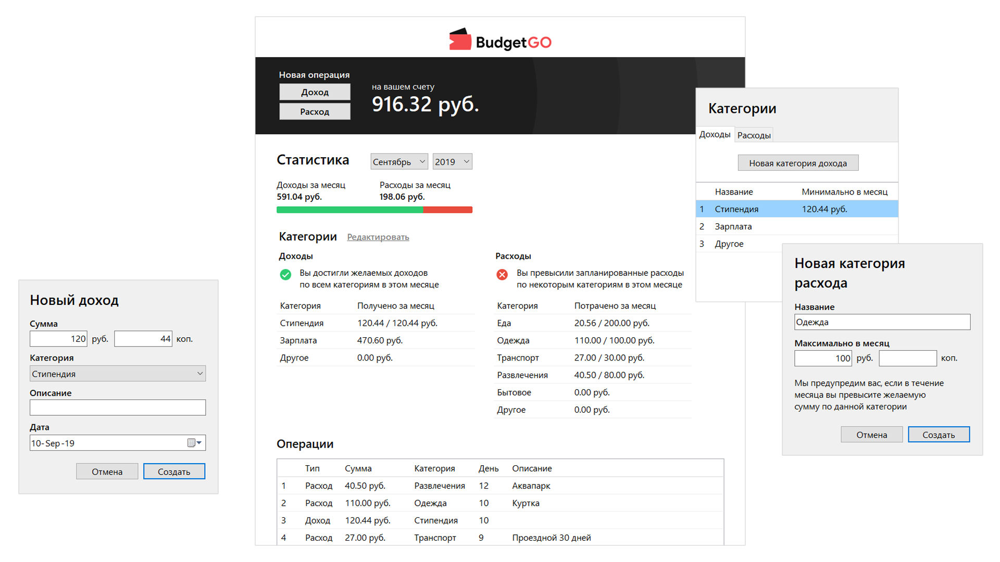

# BudgetGO
BudgetGO is an application for personal budget control. 
It allows you to store information about your incomes and outcomes in a convenient way. 
You can sort your operations by categories. 
It'll give you an opportunity to set money limits and to view categorized statistics for any month. 
You can analyze your money flow for any period of time and make decisions on how to optimize your budget.

## Running BudgetGO
Just download and run BudgetGO.exe. No installation is needed.

## Using BudgetGO
First, you should create your own categories of incomes and outcomes. Only then you'll be able to create new operations. 
While creating categories you can set money per month limits. In case of violation of limits, the application will notify you of this. 
You can edit and delete existing categories and operations. Existing operations can also be cloned. Just use the context menu in the relevant lists.

## Learning purposes
This project is made as a university course project. 
The aim was to implement my own dynamical data structures and to demonstrate working with files.
I tried to use OOP principles and even some design patterns, but I realize that there are some dirty moments in this code. 
I do my best to improve the project structure and design. See the next section.

## What's next
Now I'm working on a logical [continuation](https://github.com/oleg-grigorijan/BudgetGO) of the BudgetGO. 
I want to transfer the service to the web and make it multi-user. 
One of the tasks is to create shared storages  to be able to monitor the family budget from several accounts.